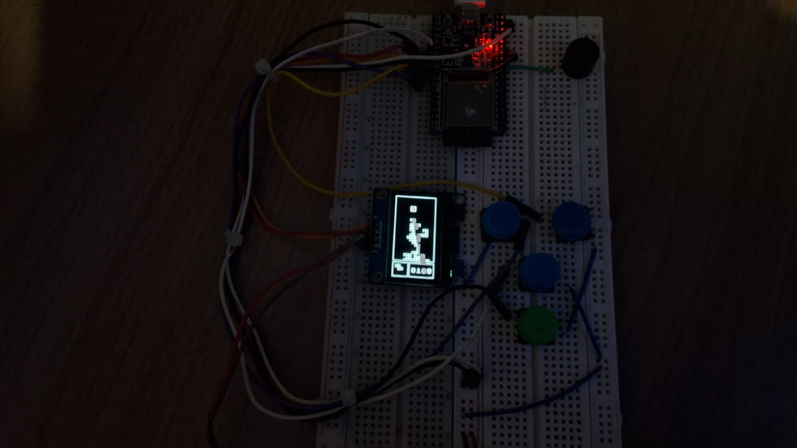

# Tetris - ESP32

El clasico juego de tetris con **ESP32** corriendo en **Micropython**

---
### Componentes: 

- 4 Botones
- 1 Pantalla oled SH1106
- 1 Zumbador 
- 1 ESP32
- 1 Protoboard (yo uso 2 porque solo tengo normales)
- Jumpers

# Enlaces de interes 
- Micropython : https://micropython.org/download/ESP32_GENERIC/ 
- Codigo de la pantalla oled SH1106: https://github.com/robert-hh/SH1106

